<div align="center">

# A U R E L I O N

### Retail Management Platform for Luxury Boutiques

Inventory · Point of Sale · Returns & Exchanges · Clienteling · Promotions · Analytics

<br>


<br>

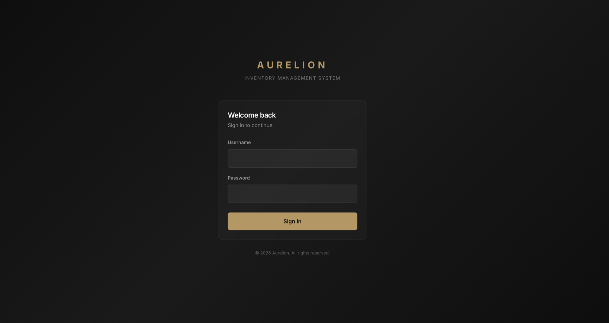

</div>

<br>

> [!IMPORTANT]
> **Showcase edition.** AURELION was built for a real luxury retail business operating a single-chain
> boutique. For confidentiality, the client's name, branding, and identifying details have been changed.
> This repository is **not the complete codebase**: it is a reduced version published for demonstration
> purposes only. The production system delivered to the client differs from what is shown here.

---

## 📑 Table of Contents

- [Overview](#-overview)
- [Key Features](#-key-features)
- [Screenshots](#-screenshots)
- [Tech Stack](#-tech-stack)
- [Architecture](#-architecture)
- [Getting Started](#-getting-started)
- [Roles & Permissions](#-roles--permissions)
- [REST API](#-rest-api)
- [Project Structure](#-project-structure)
- [License](#-license)
- [Disclaimer](#%EF%B8%8F-disclaimer)

---

## ✨ Overview

Luxury retail has different needs from ordinary retail. A single handbag can cost more than a month of
stock in a regular shop, every piece may carry a serial number and an authenticity card, and the
relationship with each client matters as much as the sale.

**AURELION** puts the whole boutique workflow in one web app: cataloguing high-value items with full
provenance, ringing up sales at the counter, handling returns and exchanges, rewarding loyal clients,
and giving the owner a live view of revenue, margin, and stock health.

| | |
|---|---|
| 🏷️ **Catalog with provenance** | Serials, authentication codes, edition numbers, packaging and provenance records |
| 🛒 **Fast checkout** | Barcode-driven POS with live promotion and loyalty pricing |
| 🔁 **Returns & exchanges** | Partial or full returns with automatic restocking and an audit trail |
| 💎 **Clienteling** | Client profiles, purchase history, and Silver, Gold, and Platinum loyalty tiers |
| 📊 **Owner analytics** | Revenue, cost, gross profit, and margin, exportable to Excel |
| 🔐 **Role-based access** | Owner, Cashier, and Sales Associate, each with a tailored workspace |

---

## 🚀 Key Features

<details open>
<summary><b>📦 Inventory & Catalog Management</b></summary>
<br>

- **Two product-entry modes:** a quick form for everyday items and an eight-section **luxury product registration form** for high-value pieces.
- **Detailed product records:** brand, collection, season, category, material and composition, condition (new or pre-owned), release year, limited-edition flag, country of origin.
- **Packaging & provenance tracking:** box, dust bag, warranty card, care card, extras, packaging condition, and free-text provenance notes.
- **Variants (SKU-level):** color, size, hardware finish, variant material, cost and retail price, multi-currency support, **unique serial numbers**, authentication codes, and edition numbers.
- **Multi-location stock:** quantity on hand, reserved, and sold per location, with a full **stock movement ledger** (in, out, adjustment, transfer).
- **Low-stock alerts** driven by per-variant minimum stock levels.
- **Image pipeline:** uploads are normalized onto square, white-background canvases with Pillow for a consistent catalog look, with support for a multi-image gallery.
- **Archive instead of delete:** retire products without losing sales history (only the owner can restore them).

</details>

<details open>
<summary><b>🏷️ Barcode Generation</b></summary>
<br>

- Select any set of variants and generate a **print-ready A4 PDF of Code 128 labels** (python-barcode + ReportLab).
- Supports EAN-13, UPC, Code 128, and internal barcode types per variant.
- The Sales Associate view includes **camera-based barcode scanning** (html5-qrcode) for instant product lookup on the shop floor.

</details>

<details open>
<summary><b>🛒 Point of Sale</b></summary>
<br>

- Scan a barcode or type a SKU to add items. Adjust quantities inline.
- Attach an existing client or create a new one without leaving the screen.
- **Live discount preview:** promotions, promo codes, and loyalty-tier pricing are calculated server-side before checkout.
- Atomic checkout (`transaction.atomic`) that writes the order, decrements stock, and records promotion usage in one step.
- Unique short order codes (e.g. `#6HUK3M`) and a **printable branded receipt**.

</details>

<details open>
<summary><b>🔁 Returns & Exchanges</b></summary>
<br>

- Look up any past order by its code and select the items and quantities to return.
- Reason codes: changed mind, defective, wrong size, wrong item, or other.
- **Refund** or **exchange** for replacement items in the same flow.
- Items go back into stock automatically, and the original order moves to *Partially Returned* or *Fully Returned*.
- Refund and replacement orders are linked to the original for a complete audit trail.

</details>

<details open>
<summary><b>💎 Clienteling & Loyalty</b></summary>
<br>

- Client profiles with contact details, birthday, notes, and communication preferences.
- Full purchase history on every client page.
- **Loyalty tiers** (Regular, Silver, Gold, Platinum) that update dynamically from lifetime spend.

</details>

<details open>
<summary><b>🎯 Promotions Engine</b></summary>
<br>

- Five promotion types: **Percentage off**, **Fixed amount off**, **Buy X Get Y Free**, **Tier-based**, and **Bundle**.
- Scope promotions to all products, a category, a brand, or hand-picked products.
- Restrict by customer tier, minimum cart value, or minimum item count.
- Scheduled start and end dates, global usage caps, per-customer caps, and an on/off toggle.

</details>

<details open>
<summary><b>📊 Reports & Analytics</b></summary>
<br>

- KPIs for gross revenue, cost of goods sold, gross profit and margin, average order value, and refunds.
- Interactive **sales trend** and **orders-per-day** charts (Chart.js).
- Top products by revenue and by quantity.
- Selectable reporting periods and a one-click **Excel export** (openpyxl).

</details>

<details open>
<summary><b>👥 Personnel Management</b></summary>
<br>

- The owner can create and remove staff accounts and assign roles.
- Each role is sent to its own dashboard after login.

</details>

---

## 📸 Screenshots

### Owner Dashboard
Today's net sales, top products, low-stock alerts, and searchable recent orders at a glance.

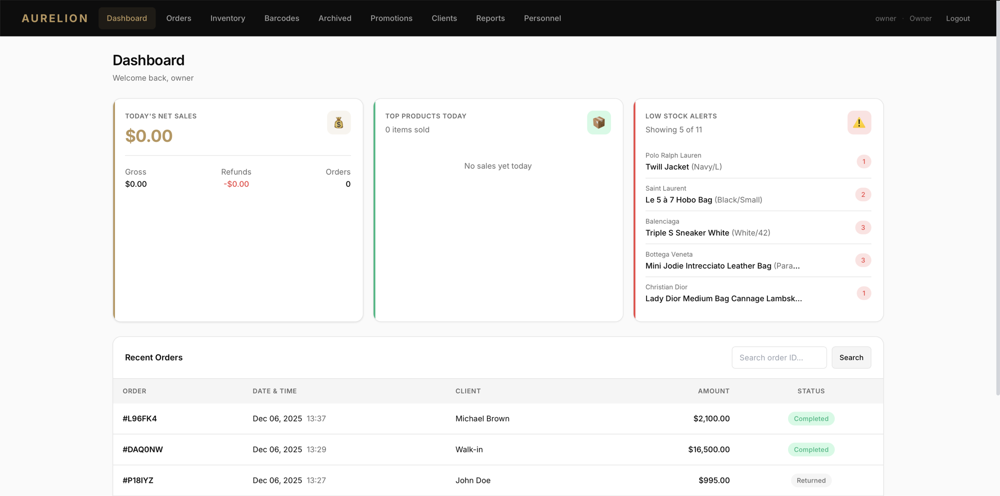

### Inventory
Filterable, searchable catalog with stock levels and pricing across all variants.

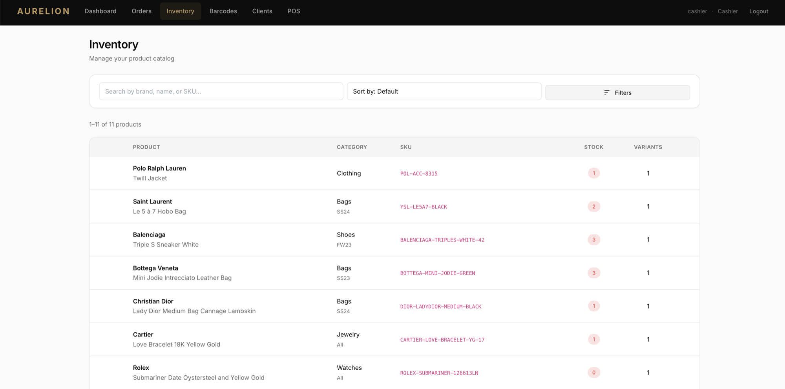

### Luxury Product Registration
A structured, eight-section form that captures everything a high-value piece needs: product identity,
SKU and codes, luxury attributes, variants with pricing and stock, packaging and accessories,
compliance and materials, media upload, and tags.

<table>
  <tr>
    <td width="50%">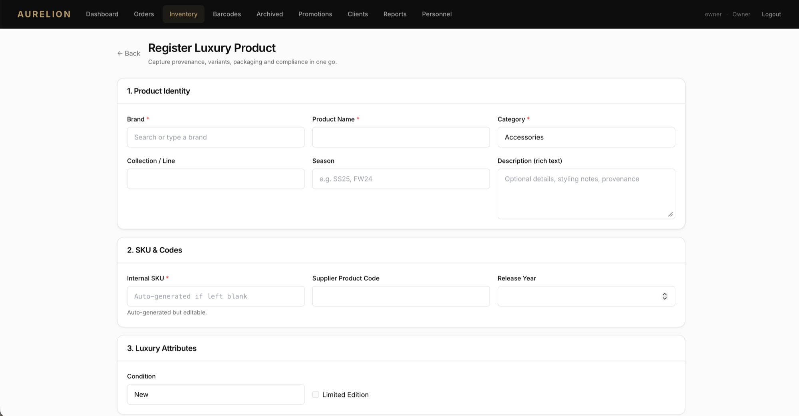<p align="center"><sub>Part 1 of 4</sub></p></td>
    <td width="50%">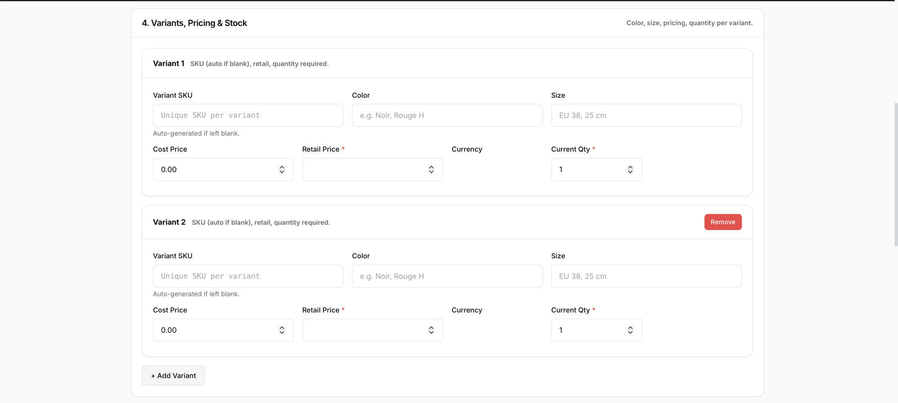<p align="center"><sub>Part 2 of 4</sub></p></td>
  </tr>
  <tr>
    <td width="50%">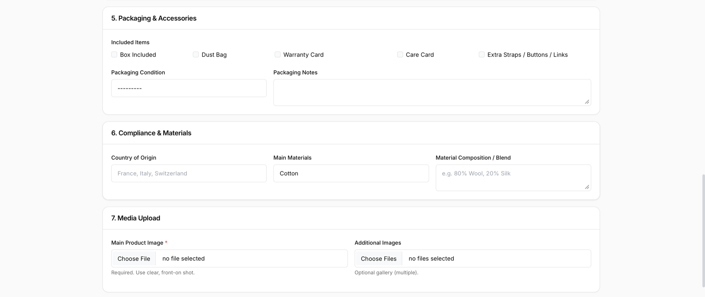<p align="center"><sub>Part 3 of 4</sub></p></td>
    <td width="50%">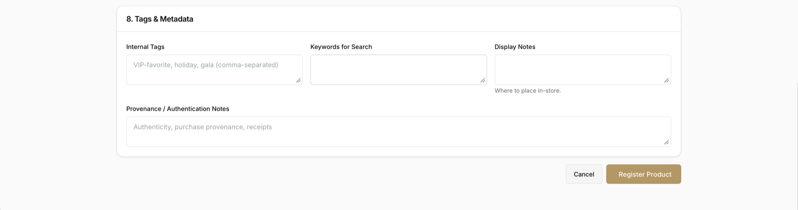<p align="center"><sub>Part 4 of 4</sub></p></td>
  </tr>
</table>

### Point of Sale
Barcode-driven checkout with client lookup, promo codes, and a live order summary.

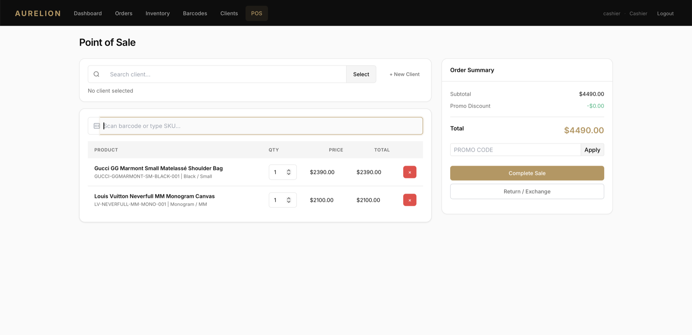

### Receipts & Barcode Labels

<table>
  <tr>
    <td width="60%">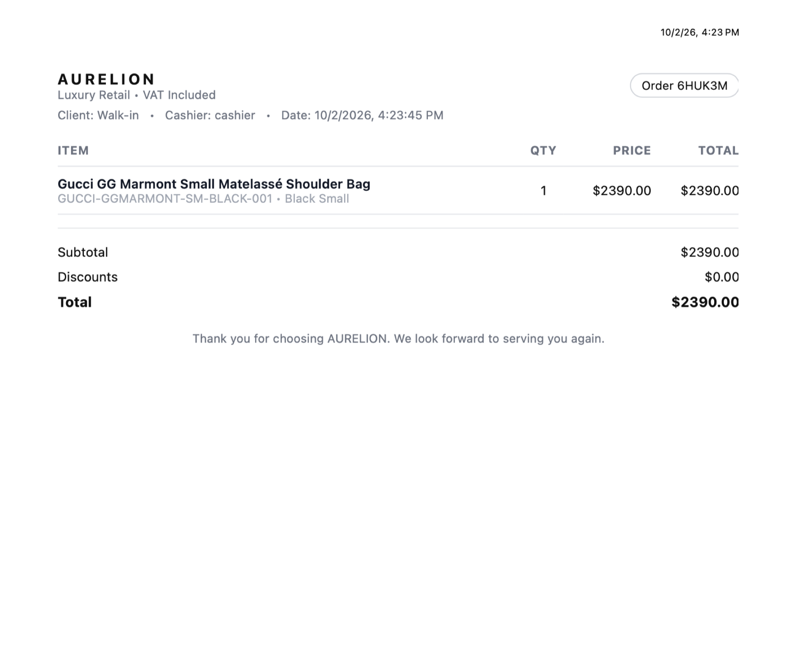<p align="center"><sub>Branded, printable customer receipt</sub></p></td>
    <td width="40%">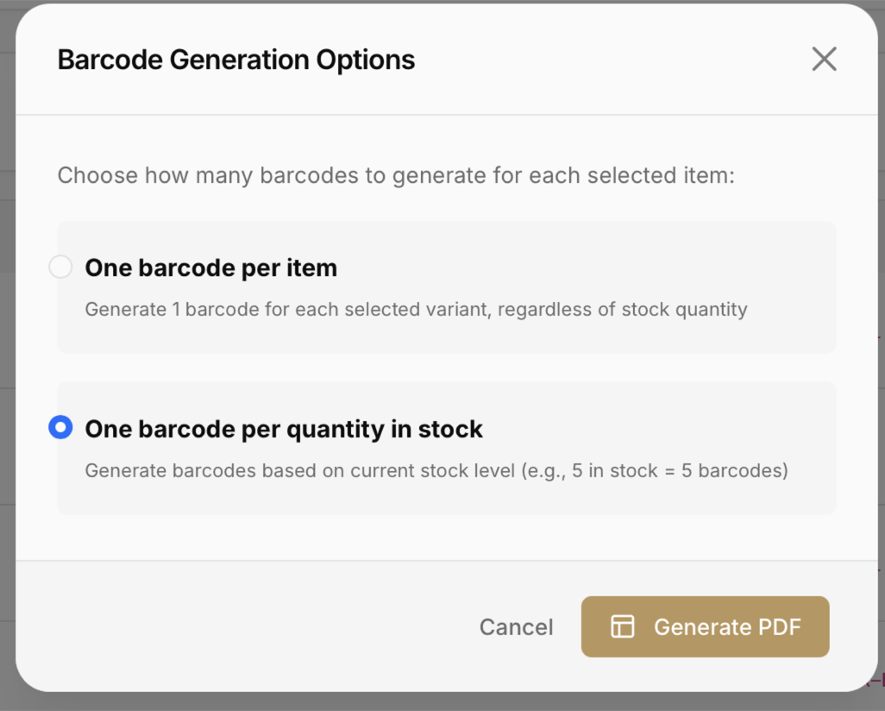<p align="center"><sub>Bulk Code 128 label generation (PDF)</sub></p></td>
  </tr>
</table>

### Orders
Complete order history with status tracking for sales, returns, and exchanges.

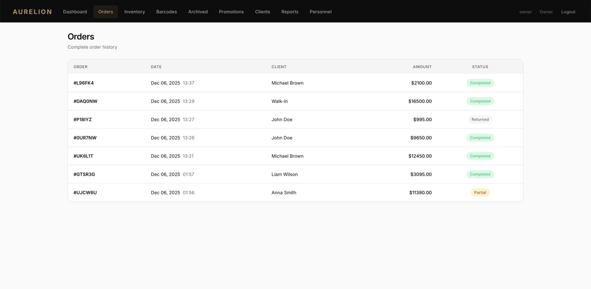

### Promotions
Create, schedule, and toggle promotions with usage tracking.

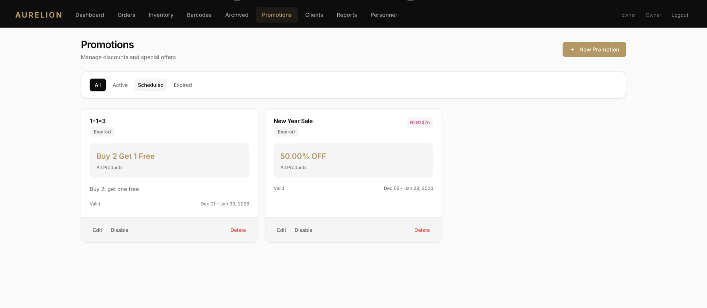

### Sales Reports
Revenue, cost, profit, and product performance with Excel export.

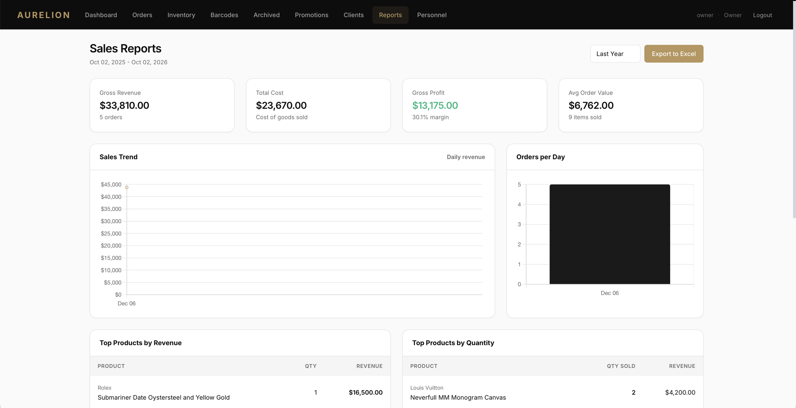

---

## 🛠 Tech Stack

| Layer | Technology |
|---|---|
| **Language** | Python 3.10+ |
| **Web framework** | Django 5.2 (class-based views, custom user model, formsets) |
| **API** | Django REST Framework 3.14 |
| **Database** | SQLite (demo) · PostgreSQL (production) |
| **Frontend** | Django Templates, Bootstrap 5.3, vanilla JavaScript, custom CSS design system, Inter typeface |
| **Charts** | Chart.js |
| **Imaging** | Pillow (image normalization) |
| **Barcodes & PDF** | python-barcode, ReportLab |
| **Spreadsheet export** | openpyxl |
| **Barcode scanning** | html5-qrcode (device camera) |
| **Static files** | WhiteNoise (compressed, hashed assets) |
| **App server** | Gunicorn |
| **Deployment** | AWS with PostgreSQL |

---

## 🏗 Architecture

```text
┌─────────────────────────────────────────────────────────┐
│  BROWSER                                                │
│  Django templates · Bootstrap · JavaScript              │
│  Camera barcode scanner (html5-qrcode)                  │
└────────────────────────────┬────────────────────────────┘
                             │  HTTPS + CSRF
┌────────────────────────────▼────────────────────────────┐
│  DJANGO APPLICATION                                     │
│                                                         │
│  Authentication & role-based permissions                │
│                                                         │
│  ┌───────────────────────────┐  ┌─────────────────────┐ │
│  │ Views                     │  │ REST API (DRF)      │ │
│  │ Inventory · POS · Returns │  │ Products · Clients  │ │
│  │ Clients · Promotions      │  │ Orders              │ │
│  │ Reports · Personnel       │  │                     │ │
│  └───────────────────────────┘  └─────────────────────┘ │
│                                                         │
│  Services: Pillow · ReportLab · barcode · openpyxl      │
└────────────────────────────┬────────────────────────────┘
                             │
         ┌───────────────────┴───────────────────┐
         ▼                                       ▼
┌─────────────────────┐               ┌─────────────────────┐
│ SQLite / PostgreSQL │               │ Media storage       │
│ (application data)  │               │ (product images)    │
└─────────────────────┘               └─────────────────────┘
```

**Core domain model:** `Product` → `ProductVariant` → `StockLevel` / `Barcode` / `StockMovement` ·
`Order` → `OrderItem` → `Return` / `ReturnItem` · `Client` → `LoyaltyAccount` · `Promotion` → `PromotionUsage`

---

## ⚙️ Getting Started

### Prerequisites

- Python **3.10** or newer
- `pip` and `venv`

### 1. Set up the environment

```bash
cd aurelion-app

python3 -m venv .venv
source .venv/bin/activate          # Windows: .venv\Scripts\activate

pip install -r requirements.txt
```

### 2. Create the database

```bash
python manage.py migrate
```

### 3. Create demo accounts

The repository ships **without a database or user accounts**. This command creates one account per role
and a default store location:

```bash
python manage.py create_demo_users
# optional: python manage.py create_demo_users --password "your-own-password"
```

| Role | Username | Password |
|---|---|---|
| 👑 Owner | `owner` | `aurelion-demo` |
| 💳 Cashier | `cashier` | `aurelion-demo` |
| 🧑‍💼 Sales Associate | `associate` | `aurelion-demo` |

> [!WARNING]
> These credentials are for **local testing only**. Never run the demo accounts in a public deployment.

### 4. Run the server

```bash
python manage.py runserver
```

Open **http://127.0.0.1:8000** and sign in. A good first walkthrough:

1. Sign in as **owner** and add a product under **Inventory → Add Product**.
2. Generate its labels under **Barcodes**.
3. Sign in as **cashier**, scan or type the SKU at **POS**, and complete a sale.
4. Process a return or exchange from the POS using the order code on the receipt.
5. Go back to **owner** and review **Reports**, then export to Excel.

### Environment variables (optional)

| Variable | Default | Purpose |
|---|---|---|
| `DJANGO_SECRET_KEY` | development key | **Required** outside local development |
| `DJANGO_DEBUG` | `True` | Set to `False` in production |
| `DJANGO_ALLOWED_HOSTS` | `*` | Comma-separated host list |
| `DJANGO_CSRF_TRUSTED_ORIGINS` | *(empty)* | Comma-separated origins, e.g. `https://example.com` |
| `DJANGO_TIME_ZONE` | system time zone | Override the detected time zone |

---

## 🔐 Roles & Permissions

Roles are **hierarchical**: each role includes everything the role below it can do.

| Capability | Sales Associate | Cashier | Owner |
|---|:---:|:---:|:---:|
| Browse inventory & product details | ✅ | ✅ | ✅ |
| Camera barcode lookup | ✅ | ✅ | ✅ |
| View clients | ✅ | ✅ | ✅ |
| Point of sale, returns & exchanges | | ✅ | ✅ |
| Create and edit products and clients | | ✅ | ✅ |
| Generate barcode labels | | ✅ | ✅ |
| View orders | | ✅ | ✅ |
| Archive products | | ✅ | ✅ |
| Delete or restore products | | | ✅ |
| Promotions | | | ✅ |
| Reports & Excel export | | | ✅ |
| Personnel management | | | ✅ |

---

## 🔌 REST API

Session-authenticated JSON endpoints, browsable through DRF's web UI at `/api/`.

| Endpoint | Methods | Access |
|---|---|---|
| `/api/products/` | `GET` `POST` `PUT` `PATCH` `DELETE` | Any authenticated user |
| `/api/clients/` | `GET` `POST` `PUT` `PATCH` `DELETE` | Sales Associate and above |
| `/api/orders/` | `GET` `POST` `PUT` `PATCH` `DELETE` | Cashier and above |
| `/health/` | `GET` | Public (database health check) |

---

## 📁 Project Structure

```
aurelion-app/
├── aurelion/                  # Project configuration
│   ├── settings.py
│   ├── urls.py
│   └── wsgi.py / asgi.py
├── core/                      # Main application
│   ├── management/commands/   # create_demo_users
│   ├── migrations/
│   ├── static/core/css/       # AURELION design system
│   ├── templates/core/        # Server-rendered UI
│   ├── templatetags/          # Number formatting filters
│   ├── models.py              # Domain model
│   ├── views.py               # Inventory, POS, returns, reports, ...
│   ├── forms.py               # Product forms & variant formsets
│   ├── permissions.py         # Role mixins & DRF permissions
│   ├── api.py / api_urls.py   # REST API
│   └── serializers.py
├── docs/screenshots/          # README images
├── manage.py
├── requirements.txt
└── LICENSE
```

---

## 📄 License

**Copyright © 2025–2026 Samandar Erkinov. All rights reserved.**

This is **proprietary software** published for portfolio viewing only. You may not copy, modify,
distribute, or use any part of this code without prior written permission.
See [`LICENSE`](LICENSE) for the full terms.

---

## ⚠️ Disclaimer

**AURELION** is a fictional retail management platform created for portfolio demonstration. Product names,
trademarks, and brand references are used solely to demonstrate catalog and inventory functionality.
AURELION is not affiliated with or endorsed by the referenced brands.

This repository is a **demonstration build**. It is not the complete source code, and the production
system delivered to the client differs from it. The client's identity has been withheld for confidentiality.

<div align="center">
<br>
<sub>Designed & developed by <b>Samandar Erkinov</b></sub>
</div>
